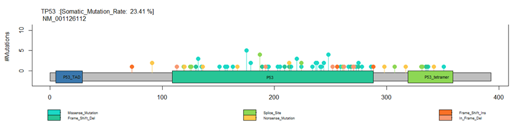

<!-- Improved compatibility of back to top link: See: https://github.com/othneildrew/Best-README-Template/pull/73 -->

<!-- PROJECT LOGO -->
 

<h3 align="center">Mutation and Protein Domain Visualization Tool - lollipop plot </h3>

  

    Department of Bioinformatics, IBB, University of Tehran
     
  

  

<!-- TABLE OF CONTENTS -->

  
Table of Contents

  <ol>
    <li>
      <a href="#ROADMAP">ROADMAP</a>
    </li>
    <li><a href="#Usage">Usage</a></li>
    <li>
      <a href="#Customization">Customization</a>
    </li>
    <li><a href="#Note">Note</a></li>
  </ol>

<!-- ABOUT THE PROJECT -->
## ROADMAP

This R script utilizes the maftools and other libraries to create an interactive visualization of mutations and protein domains for a specified gene. The script reads a Mutation Annotation Format (MAF) file and a protein database, allowing users to explore the distribution of mutations across the gene and visualize protein domains. The resulting plot includes a representation of the entire gene, highlighting different mutation types, and delineating protein domains. The script provides valuable insights into the mutation landscape and protein structure of the specified gene.
  

(<a href="#readme-top">back to top</a>)

## Languages Used

R Packages 

(<a href="#readme-top">back to top</a>)

<!-- GETTING STARTED -->
### Usage:
<ol id="Usage">
  <li>Install required libraries (maftools, stringr).</li>
  <li>Load mutation data (MAF file) and protein database (prot_db.RData).</li>
  <li>Customize the gene of interest (Gene_Name and Ref_seq).</li>
  <li>Run the script to generate a comprehensive visualization.</li>
  <li>Explore the plot to understand mutation distribution and protein domain locations.</li>
</ol>

### Customization:
<ul id="Customization">
  <li>Adjust plot coordinates, colors, and styles to suit specific preferences.</li>
  <li>Easily apply the script to different genes by updating the Gene_Name and Ref_seq variables.</li>
</ul>

### Note:
<ul id="Note">
  <li>This tool is particularly useful for researchers and bioinformaticians working with cancer genomics data.</li>
  <li>Ensure that the required data files are properly formatted and available before running the script.</li>
</ul>
Feel free to tailor the title and description based on the specific features and focus of your tool.

(<a href="#readme-top">back to top</a>)

(<a href="#readme-top">back to top</a>)

<!-- CONTACT -->
## Contact

vafaeeshaarbaf@gmail.com

(<a href="#readme-top">back to top</a>)

<!-- ACKNOWLEDGMENTS -->
## Acknowledgments

Department of Bioinformatics, IBB, University of Tehran

(<a href="#readme-top">back to top</a>)

<!-- MARKDOWN LINKS & IMAGES -->
<!-- https://www.markdownguide.org/basic-syntax/#reference-style-links -->
[contributors-shield]: https://img.shields.io/github/contributors/github_username/repo_name.svg?style=for-the-badge
[contributors-url]: https://github.com/github_username/repo_name/graphs/contributors
[forks-shield]: https://img.shields.io/github/forks/github_username/repo_name.svg?style=for-the-badge
[forks-url]: https://github.com/github_username/repo_name/network/members
[stars-shield]: https://img.shields.io/github/stars/github_username/repo_name.svg?style=for-the-badge
[stars-url]: https://github.com/github_username/repo_name/stargazers
[issues-shield]: https://img.shields.io/github/issues/github_username/repo_name.svg?style=for-the-badge
[issues-url]: https://github.com/github_username/repo_name/issues
[license-shield]: https://img.shields.io/github/license/github_username/repo_name.svg?style=for-the-badge
[license-url]: https://github.com/github_username/repo_name/blob/master/LICENSE.txt
[linkedin-shield]: https://img.shields.io/badge/-LinkedIn-black.svg?style=for-the-badge&logo=linkedin&colorB=555
[linkedin-url]: https://linkedin.com/in/linkedin_username
[product-screenshot]: images/screenshot.png
[Next.js]: https://img.shields.io/badge/next.js-000000?style=for-the-badge&logo=nextdotjs&logoColor=white
[Next-url]: https://nextjs.org/
[React.js]: https://img.shields.io/badge/React-20232A?style=for-the-badge&logo=react&logoColor=61DAFB
[React-url]: https://reactjs.org/
[Vue.js]: https://img.shields.io/badge/Vue.js-35495E?style=for-the-badge&logo=vuedotjs&logoColor=4FC08D
[Vue-url]: https://vuejs.org/
[Angular.io]: https://img.shields.io/badge/Angular-DD0031?style=for-the-badge&logo=angular&logoColor=white
[Angular-url]: https://angular.io/
[Svelte.dev]: https://img.shields.io/badge/Svelte-4A4A55?style=for-the-badge&logo=svelte&logoColor=FF3E00
[Svelte-url]: https://svelte.dev/
[Laravel.com]: https://img.shields.io/badge/Laravel-FF2D20?style=for-the-badge&logo=laravel&logoColor=white
[Laravel-url]: https://laravel.com
[Bootstrap.com]: https://img.shields.io/badge/Bootstrap-563D7C?style=for-the-badge&logo=bootstrap&logoColor=white
[Bootstrap-url]: https://getbootstrap.com
[JQuery.com]: https://img.shields.io/badge/jQuery-0769AD?style=for-the-badge&logo=jquery&logoColor=white
[JQuery-url]: https://jquery.com 
